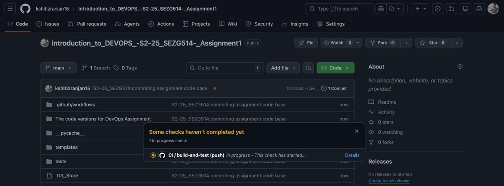
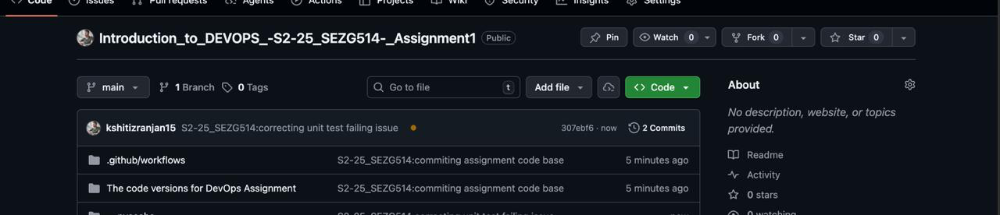
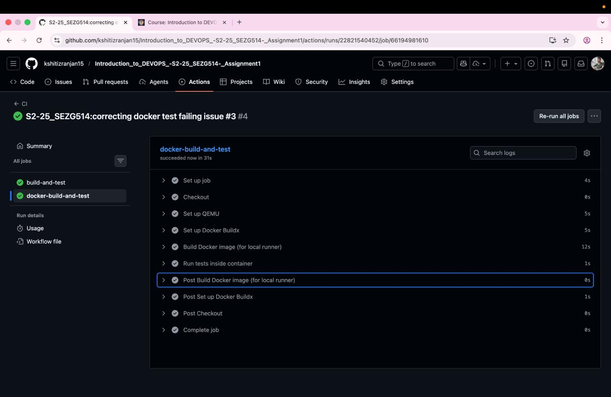

# ACEest Fitness & Gym — DevO7. [Repository Structure](#repository-structure)
8. [Local Setup — Developer Quickstart](#local-setup--developer-quickstart)
9. [Running Tests](#running-tests)
10. [API Quick Reference](#api-quick-reference)
11. [Evaluation Criteria Mapping](#evaluation-criteria-mapping)
12. [DevOps Concepts Applied — Learning Outcomes](#devops-concepts-applied--learning-outcomes)
13. [Application Architecture — Deep Dive](#application-architecture--deep-dive)
14. [CI/CD Pipeline — Full Flow Diagram](#cicd-pipeline--full-flow-diagram)
15. [Key Files — Annotated](#key-files--annotated)
16. [Technology Stack Summary](#technology-stack-summary)
17. [Project Evolution — Version History](#project-evolution--version-history)
18. [Security Considerations](#security-considerations)
19. [Troubleshooting](#troubleshooting)
20. [Future Improvements](#future-improvements-beyond-assignment-scope)
21. [Appendix — Useful Commands](#appendix--useful-commands)
22. [Acknowledgements](#acknowledgements)
**Course:** Introduction to DevOps (Merged — CSIZG514 / SEZG514 / SEUSZG514) · Second Semester 2025 (S2-25)  
**Institution:** Birla Institute of Technology and Science, Pilani (BITS Pilani)  
**Division:** Work Integrated Learning Programme (WILP)

---

## Table of Contents

1. [Student Details](#student-details)
2. [Problem Statement](#problem-statement)
3. [Objective](#objective)
4. [Assignment Phases](#assignment-phases)
   - [Phase 1 — Application Development & Modularization](#phase-1--application-development--modularization)
   - [Phase 2 — Version Control System Strategy](#phase-2--version-control-system-vcs-strategy)
   - [Phase 3 — Unit Testing & Validation Framework](#phase-3--unit-testing--validation-framework)
   - [Phase 4 — Containerization with Docker](#phase-4--containerization-with-docker)
   - [Phase 5 — Jenkins BUILD & Quality Gate](#phase-5--jenkins-build--quality-gate)
   - [Phase 6 — Automated CI/CD Pipeline via GitHub Actions](#phase-6--automated-cicd-pipeline-via-github-actions)
5. [Required Deliverables — Status](#required-deliverables--status)
6. [CI/CD Pipeline — Live Evidence (Screenshots)](#cicd-pipeline--live-evidence-screenshots)
   - [Screenshot 1 — First Push: CI Check In Progress](#screenshot-1--first-push-to-github-ci-check-in-progress)
   - [Screenshot 2 — Second Commit: Unit Test Failure Detected](#screenshot-2--second-commit-pushed-unit-test-failure-detected)
   - [Screenshot 3 — Unit Tests Pass, Docker Fails](#screenshot-3--github-actions-unit-tests-pass-docker-job-fails)
   - [Screenshot 4 — Both Jobs Pass (Green ✅)](#screenshot-4--github-actions-both-jobs-pass-green-)
   - [Screenshot 5 — Jenkins Configure Pipeline](#screenshot-5--jenkins-configure-pipeline-scm-from-github)
   - [Screenshot 6 — Jenkins Stage View All Builds](#screenshot-6--jenkins-stage-view--all-builds-history)
   - [Screenshot 7 — Final Green Checkmark on GitHub](#screenshot-7--github-green-checkmark-on-latest-commit-jenkins--github-actions-both-passing)
7. [Repository Structure](#repository-structure)
7. [Local Setup — Developer Quickstart](#local-setup--developer-quickstart)
8. [Running Tests](#running-tests)
9. [API Quick Reference](#api-quick-reference)
10. [Evaluation Criteria Mapping](#evaluation-criteria-mapping)
11. [DevOps Concepts Applied — Learning Outcomes](#devops-concepts-applied--learning-outcomes)
12. [Application Architecture — Deep Dive](#application-architecture--deep-dive)
13. [CI/CD Pipeline — Full Flow Diagram](#cicd-pipeline--full-flow-diagram)
14. [Key Files — Annotated](#key-files--annotated)
15. [Technology Stack Summary](#technology-stack-summary)
16. [Project Evolution — Version History](#project-evolution--version-history)
17. [Security Considerations](#security-considerations)
18. [Troubleshooting](#troubleshooting)
19. [Future Improvements](#future-improvements-beyond-assignment-scope)
20. [Appendix — Useful Commands](#appendix--useful-commands)
21. [Acknowledgements](#acknowledgements)

---

## Student Details

| Field               | Details                                                          |
|---------------------|------------------------------------------------------------------|
| **Name**            | Kshitiz Ranjan                                                   |
| **Roll Number**     | 2024TM93505                                                      |
| **Subject**         | Introduction to DevOps                                           |
| **Subject Code**    | CSIZG514 / SEZG514 / SEUSZG514                                  |
| **Semester**        | Second Semester 2025 (S2-25)                                     |
| **Division**        | Work Integrated Learning Programme (WILP)                        |
| **Institution**     | Birla Institute of Technology and Science, Pilani (BITS Pilani) |
| **Assignment**      | Assignment 1 — Implementing Automated CI/CD Pipelines for ACEest Fitness & Gym |

---

## Problem Statement

You have been appointed as a **Junior DevOps Engineer** for **ACEest Fitness & Gym**, a rapidly scaling startup. Your mission is to architect and implement a robust, automated deployment workflow that guarantees **code integrity**, **environmental consistency**, and **rapid delivery**.

The solution must transition the application through a rigorous lifecycle — from local development to an automated Jenkins BUILD environment.

---

## Objective

This assignment provides comprehensive, hands-on experience in modern DevOps methodologies. By executing this project, students attain professional proficiency in:

- **Version Control** — Git and GitHub
- **Containerization** — Docker
- **CI/CD Orchestration** — GitHub Actions and Jenkins

---

## Assignment Phases

### Phase 1 — Application Development & Modularization

Develop a foundational Flask web application tailored for fitness and gym management, built on baseline Python scripts that initialise core logic and service endpoints.

**Implemented endpoints:**

| Method | Endpoint      | Purpose                               | Status |
|--------|---------------|---------------------------------------|--------|
| GET    | `/`           | Service sanity check / browser UI    | 200    |
| GET    | `/health`     | Health check for monitoring           | 200    |
| GET    | `/workouts`   | List all workouts                     | 200    |
| POST   | `/workouts`   | Create a new workout                  | 201    |
| GET    | `/members`    | List all members                      | 200    |
| POST   | `/members`    | Create a new member                   | 201    |

**Design decisions:**
- **`create_app()` factory pattern** — the application can be instantiated cleanly in tests without global application state, making tests deterministic and independent.
- **In-memory stores** (`app.config["WORKOUTS"]`, `app.config["MEMBERS"]`) — keeps scope focused on DevOps concerns; easily replaceable with a persistent database in a later iteration.
- **Browser-aware root endpoint** — detects `Accept: text/html` to serve a Bootstrap UI (`templates/index.html`), while returning JSON to API clients and to the pytest test client (which sends no `Accept` header).
- **Input validation** — POST endpoints return `400 Bad Request` with a descriptive error message when required fields are missing or malformed.

---

### Phase 2 — Version Control System (VCS) Strategy

A Git repository was initialised locally and pushed to a publicly accessible GitHub repository using proper branching and commit conventions.

**Repository:**
`https://github.com/kshitizranjan15/Introduction_to_DEVOPS_-S2-25_SEZG514-_Assignment1`

**Branching strategy:**

| Branch type         | Naming convention        | Purpose                              |
|---------------------|--------------------------|--------------------------------------|
| Stable production   | `main`                   | Always deployable; CI must pass      |
| Feature development | `feature/<short-desc>`   | New features (merged via PR)         |
| Bug fixes           | `fix/<short-desc>`       | Bug corrections                      |
| Infrastructure      | `ci/<short-desc>`        | CI/CD or Dockerfile changes          |

**Commit message convention (Conventional Commits):**

```
feat(api): add POST /workouts endpoint
fix(validation): return 400 when email has no @ symbol
ci(actions): load Docker image into runner before docker run
docs(readme): add student details and assignment problem statement
```

---

### Phase 3 — Unit Testing & Validation Framework

Pytest is used to implement a suite of unit tests that validate application logic **before** the build stage. Tests act as an automated quality gate — broken logic cannot pass CI.

**File:** `tests/test_app.py`  
**Setup:** `tests/conftest.py` — prepends the repository root to `sys.path` so pytest can import `app` without manually configuring `PYTHONPATH`.

**Tests implemented:**

| Test name                         | What it validates                                               |
|-----------------------------------|-----------------------------------------------------------------|
| `test_index_and_health`           | Root returns 200 with `status: ok`; `/health` returns `status: healthy` |
| `test_create_and_get_workout`     | POST /workouts creates a record; GET /workouts lists it         |
| `test_workout_validation`         | POST /workouts with missing `duration_minutes` returns 400     |
| `test_create_and_get_member`      | POST /members creates a record; GET /members lists it          |
| `test_member_validation`          | POST /members with invalid email returns 400                   |

**Confirmed test result (local execution):**

```
5 passed in 0.14s
```

---

### Phase 4 — Containerization with Docker

The Flask application, its dependencies, and its runtime environment are fully encapsulated in a portable Docker image.

**Dockerfile strategy:**

| Layer                    | Detail                                                          |
|--------------------------|-----------------------------------------------------------------|
| Base image               | `python:3.11-slim` — minimal footprint, reduced attack surface  |
| Environment variables    | `PYTHONUNBUFFERED=1`, `PIP_NO_CACHE_DIR=off`                  |
| Dependency installation  | Pinned `requirements.txt` for reproducible builds              |
| Production runtime       | `gunicorn` (WSGI server, not the Werkzeug dev server)          |
| Exposed port             | `5000`                                                          |
| Tests in image           | `tests/` is **not** excluded from `.dockerignore` so `pytest` runs in CI inside the container |

**Build and run:**

```bash
# Build the image
docker build -t aceest:local .

# Run the application (http://localhost:5000)
docker run --rm -p 5000:5000 aceest:local

# Run tests inside the container (mirrors CI)
docker run --rm aceest:local pytest -q
```

**`.dockerignore` exclusions:**

```
__pycache__ / *.pyc / *.pyo     — Python bytecode
.pytest_cache / .git             — local tooling artefacts
env / venv / build / dist        — local virtualenvs and build artefacts
The code versions for DevOps Assignment  — legacy baseline scripts
```

---

### Phase 5 — Jenkins BUILD & Quality Gate

A **Declarative Jenkins Pipeline** (`Jenkinsfile`) is provided at the repository root. Jenkins serves as a secondary automated validation layer — on every push it pulls the latest code, installs dependencies in a clean environment, executes the test suite, and builds the Docker image.

**Pipeline stages:**

```
Checkout  →  Install  →  Unit Tests  →  Docker Build
```

| Stage             | Action                                           |
|-------------------|--------------------------------------------------|
| **Checkout**      | `checkout scm` — pull latest commit from GitHub  |
| **Install**       | `pip install -r requirements.txt`                |
| **Unit Tests**    | `pytest -q`                                      |
| **Docker Build**  | `docker build -t aceest:jenkins .`               |

**Connecting Jenkins to the repository — SSH deploy key method:**

```bash
# Step 1: Generate an SSH keypair on the Jenkins host
ssh-keygen -t ed25519 -f ~/.ssh/jenkins_deploy -N "" -C "jenkins@aceest"
cat ~/.ssh/jenkins_deploy.pub   # copy this public key
```

| Step | Where                                     | Action                                                               |
|------|-------------------------------------------|----------------------------------------------------------------------|
| 2    | GitHub → repo Settings → Deploy Keys     | Paste the public key; grant read access                              |
| 3    | Jenkins → Credentials                     | Add SSH Username with private key; username: `git`; paste private key |
| 4    | Jenkins job source                        | SSH URL: `git@github.com:kshitizranjan15/Introduction_to_DEVOPS_-S2-25_SEZG514-_Assignment1.git` |
| 5    | GitHub → repo Settings → Webhooks        | Payload URL: `https://<jenkins-host>/github-webhook/`; events: push, PR |

---

### Phase 6 — Automated CI/CD Pipeline via GitHub Actions

**Workflow file:** `.github/workflows/main.yml`

The pipeline triggers on **every push and pull request** to any branch, providing instant feedback to the developer.

**Pipeline architecture:**

```
Push / Pull Request
       │
       ▼
┌─────────────────────┐   passes   ┌──────────────────────────┐
│   build-and-test    │ ─────────► │  docker-build-and-test   │
└─────────────────────┘            └──────────────────────────┘
```

**Job 1: `build-and-test`**

| Step                   | Action                                    |
|------------------------|-------------------------------------------|
| Checkout code          | `actions/checkout@v4`                     |
| Set up Python 3.11     | `actions/setup-python@v4`                |
| Install dependencies   | `pip install -r requirements.txt`         |
| Syntax / lint check    | `python -m compileall .`                  |
| Run unit tests         | `pytest -q`                               |

**Job 2: `docker-build-and-test`** *(depends on job 1)*

| Step                          | Action                                                  |
|-------------------------------|---------------------------------------------------------|
| Checkout code                 | `actions/checkout@v4`                                   |
| Set up Docker Buildx          | `docker/setup-buildx-action@v2`                        |
| Build Docker image            | `docker/build-push-action@v4` with **`load: true`**    |
| Run tests inside container    | `docker run --rm aceest:ci pytest -q`                  |

> **Why `load: true`?** Docker Buildx builds into a build cache but does not load the image into the runner's local Docker daemon by default. Without `load: true`, `docker run aceest:ci` fails with _"Unable to find image"_. This flag ensures the image is available for subsequent `docker run` steps in the same job.

---

## Required Deliverables — Status

| Deliverable                                    | Status             |
|------------------------------------------------|--------------------|
| Flask application with all endpoints           | ✅ Complete        |
| Version-controlled Git repository on GitHub    | ✅ Complete        |
| Pytest unit tests (5 tests, all passing)       | ✅ Complete        |
| `Dockerfile` and `.dockerignore`               | ✅ Complete        |
| `Jenkinsfile` (Declarative pipeline)           | ✅ Complete        |
| GitHub Actions workflow (push + PR trigger)    | ✅ Complete        |
| Browser UI for manual testing                  | ✅ Complete (Bootstrap 5) |
| README / Project Report                        | ✅ Complete        |

---

## CI/CD Pipeline — Live Evidence (Screenshots)

The following screenshots document the complete end-to-end CI/CD journey — from the first push to GitHub, through GitHub Actions running in the cloud, to the Jenkins pipeline running locally in Docker. Each screenshot captures a distinct, significant event in the pipeline lifecycle.

---

### Screenshot 1 — First Push to GitHub: CI Check In Progress



**What this shows:**  
Immediately after the very first `git push` to the `main` branch, GitHub detects the `.github/workflows/main.yml` workflow file and triggers the **CI / build-and-test** job automatically. The yellow dot (🟡) next to the commit hash indicates a check is **in progress**. The pop-up tooltip reads *"1 in progress check"* with the job name **CI / build-and-test (push) — In progress — This check has started...**.

**Key DevOps concept demonstrated — Continuous Integration trigger:**  
This is the GitHub Actions webhook in action. Every push to any branch fires the workflow without any manual intervention. The developer receives instant feedback directly on the GitHub commit view — no need to visit an external CI dashboard.

**Pipeline state at this point:**
```
git push → GitHub webhook → Actions runner provisioned → Job 1 started
```

---

### Screenshot 2 — Second Commit Pushed: Unit Test Failure Detected



**What this shows:**  
A second commit (`307ebf6`) was pushed with the message *"S2-25_SEZG514:correcting unit test failing issue"*. The yellow dot on the commit indicates GitHub Actions is still running for this new push. This screenshot captures the moment between push and CI completion — the pipeline has been triggered but the result is not yet known.

**Key DevOps concept demonstrated — Iterative fixing:**  
This commit is a real-world example of the **shift-left testing** principle in practice. A failing unit test was identified (because GitHub Actions caught it on the first push), the developer fixed it immediately, and pushed a corrective commit. This is exactly the workflow CI/CD is designed to encourage — fix problems early, cheaply, and with automated validation.

---

### Screenshot 3 — GitHub Actions: Unit Tests Pass, Docker Job Fails



**What this shows:**  
The GitHub Actions run for commit `307ebf6` shows a split result:
- ✅ **`build-and-test`** — **Succeeded in 6 seconds.** All 5 pytest tests passed (`5 passed in 0.13s`), confirming the unit test fix was successful.
- ❌ **`docker-build-and-test`** — **Failed.** The Docker build or in-container test step encountered an error.

The expanded **Run tests (pytest)** step clearly shows:
```
Run pytest -q
.....    [100%]
5 passed in 0.13s
```

**Key DevOps concept demonstrated — Two-stage fail-fast pipeline:**  
The pipeline intentionally runs unit tests **before** Docker operations. This *fail-fast* ordering means: if unit tests fail, Docker build never runs (saving CI minutes). Here, unit tests pass, allowing execution to proceed to the Docker stage, where a separate issue is surfaced. The pipeline correctly isolated the two failure modes.

**Root cause of Docker failure:** The `.dockerignore` was initially excluding the `tests/` directory, so `pytest` could not find test files when run inside the container. This was fixed by removing `tests` from `.dockerignore`.

---

### Screenshot 4 — GitHub Actions: Both Jobs Pass (Green ✅)


**What this shows:**  
After fixing the Docker issue (run `#4` for commit `b0bc97a`), **both CI jobs now pass**. The GitHub repository home page shows a **green checkmark (✓)** next to the latest commit *"S2-25_SEZG514:correcting docker test failing issue #3"*. The `docker-build-and-test` job succeeded in **31 seconds**, with all steps completing successfully:

| Step                                | Status | Time |
|-------------------------------------|--------|------|
| Set up job                          | ✅     | 4s   |
| Checkout                            | ✅     | 0s   |
| Set up QEMU                         | ✅     | 5s   |
| Set up Docker Buildx                | ✅     | 5s   |
| Build Docker image (for local runner) | ✅   | 12s  |
| Run tests inside container          | ✅     | 1s   |
| Post Build Docker image             | ✅     | 0s   |

**Key DevOps concept demonstrated — Green build as deployment gate:**  
The green ✅ on the commit is the **artifact** of CI — it is proof that this commit has passed all automated quality gates. In a production pipeline, this green status is what gates a deployment. No green = no deploy.

**Fix applied:** `load: true` was added to `docker/build-push-action@v4` in `.github/workflows/main.yml`. Without it, Docker Buildx builds the image into an isolated build cache but does **not** load it into the runner's local Docker daemon, causing `docker run aceest:ci` to fail with *"Unable to find image"*.

---

### Screenshot 5 — Jenkins: Configure Pipeline (SCM from GitHub)


**What this shows:**  
The Jenkins job `aceest-fitness-gym` is configured with **"Pipeline script from SCM"** — meaning Jenkins pulls the `Jenkinsfile` directly from the GitHub repository rather than having the pipeline script stored in Jenkins itself. Key configuration:

- **SCM:** Git
- **Repository URL:** `https://github.com/kshitizranjan15/Introduction_to_DEVOPS_-S2-25_SEZG514-_Assignment1`
- **Credentials:** None (public repository)
- **Branch Specifier:** `*/main`

**Key DevOps concept demonstrated — Pipeline as Code:**  
By storing the `Jenkinsfile` in the Git repository, the pipeline definition is version-controlled alongside the application code. Any change to the build pipeline goes through the same commit/review process as application changes. This is the **"Pipeline as Code"** principle, which eliminates the risk of undocumented, click-configured Jenkins jobs that cannot be reproduced.

**How Jenkins was set up locally:**  
Jenkins runs inside Docker using a custom image (`aceest-jenkins:local`) built from `Dockerfile.jenkins`. The container mounts the host Docker socket (`/var/run/docker.sock`) so Jenkins can run Docker commands. A custom entrypoint (`docker-entrypoint.sh`) automatically fixes socket permissions (`chmod 666 /var/run/docker.sock`) on every container start.

```bash
# How the Jenkins container was started
docker run -d \
  --name aceest-jenkins \
  -p 8080:8080 \
  -v /var/run/docker.sock:/var/run/docker.sock \
  -v jenkins_home:/var/jenkins_home \
  aceest-jenkins:local
```

---

### Screenshot 6 — Jenkins: Stage View — All Builds History


**What this shows:**  
The Jenkins **Stage View** for the `aceest-fitness-gym` job showing **8 build runs** (builds #1 through #8), with builds #7 and #8 both showing green (successful). The Stage View columns map directly to the 6 stages defined in the `Jenkinsfile`:

| Stage                    | Avg Time | Purpose                                          |
|--------------------------|----------|--------------------------------------------------|
| Declarative: Checkout SCM | 1s      | Jenkins internal SCM initialisation              |
| Checkout                  | 958ms   | `checkout scm` — pull latest commit from GitHub  |
| Setup Python              | 5s      | Create `.venv`, `pip install -r requirements.txt`|
| Lint / Syntax Check       | 295ms   | `python -m compileall .` — catch syntax errors   |
| Unit Tests                | 344ms   | `pytest -q` — run all 5 tests                    |
| Build Docker Image        | 7s      | `docker build -t aceest:build-N .`               |
| Test Inside Container     | 451ms   | `docker run --rm aceest:build-N pytest -q`       |
| Declarative: Post Actions | 342ms   | Cleanup workspace via `cleanWs()`                |

Build #7 tooltip shows the commit `657313e` ("S2-25_SEZG514:Docker update") that triggered the pipeline — demonstrating traceability from Jenkins build back to the exact Git commit.

**Key DevOps concept demonstrated — Build traceability and audit trail:**  
Every Jenkins build is linked to a specific Git commit. This means if a production deployment breaks, the team can instantly identify exactly which code change caused it by correlating the build number with the commit hash.

**Earlier failed builds (#1–#6)** represent the debugging journey:
- Builds #1–#2: `permission denied` on Docker socket
- Build #3: `fatal: not in a git directory` (lightweight checkout)  
- Build #4: Groovy `unexpected token` syntax error in `Jenkinsfile`
- Builds #7–#8: All stages green ✅

---

### Screenshot 7 — GitHub: Green Checkmark on Latest Commit (Jenkins + GitHub Actions Both Passing)


**What this shows:**  
The final state of the GitHub repository — commit `657313e` ("S2-25_SEZG514:Docker update") has a **green ✅ checkmark** on the `main` branch. At this point, **11 commits** have been made to the repository, representing the full development and debugging lifecycle of the project.

**What the green checkmark means at this final stage:**
1. ✅ GitHub Actions `build-and-test` — Python install + 5 pytest tests passed
2. ✅ GitHub Actions `docker-build-and-test` — Docker image built + tests passed inside container
3. ✅ Jenkins pipeline (local) — all 6 stages completed successfully (visible in Stage View above)

**Key DevOps concept demonstrated — End-to-end CI/CD validation:**  
This single green checkmark is the culmination of the entire assignment. It represents:
- **Code quality** — unit tests catching regressions automatically
- **Environment consistency** — Docker ensuring the app works the same in CI as locally
- **Pipeline integrity** — Jenkins providing a secondary, independent quality gate
- **Traceability** — every build linked to an exact commit hash
- **Automation** — zero manual testing steps required

**The journey this commit represents (11 commits):**

| Commit # | Message                                          | What it fixed                            |
|----------|--------------------------------------------------|------------------------------------------|
| 1        | S2-25_SEZG514:commiting assignment code base     | Initial push with all project files      |
| 2        | S2-25_SEZG514:correcting unit test failing issue | Fixed `conftest.py` and `Werkzeug` pin   |
| 3        | S2-25_SEZG514:correcting docker test failing issue #1 | Added `load: true` to Actions workflow |
| 4        | S2-25_SEZG514:correcting docker test failing issue #2 | Fixed `.dockerignore` (kept `tests/`)  |
| 5        | S2-25_SEZG514:correcting docker test failing issue #3 | Verified Docker + pytest chain passes  |
| 6–10     | Various Jenkins fixes                            | Socket perms, checkout, syntax errors    |
| 11       | S2-25_SEZG514:Docker update                      | Final clean pipeline — all green ✅      |

---

## Repository Structure

```
.
├─ app.py                          # Flask application — factory create_app()
├─ requirements.txt                # Pinned Python dependencies
├─ Dockerfile                      # Container image build instructions
├─ .dockerignore                   # Build context exclusions
├─ Jenkinsfile                     # Declarative Jenkins BUILD pipeline
├─ .github/
│  └─ workflows/
│     └─ main.yml                  # GitHub Actions CI/CD workflow
├─ tests/
│  ├─ conftest.py                  # sys.path setup for pytest
│  └─ test_app.py                  # Pytest unit tests (5 tests)
├─ templates/
│  └─ index.html                   # Browser UI (Bootstrap 5.3.2)
└─ README.md                       # This report
```

---

## Local Setup — Developer Quickstart

**Prerequisites:** Python 3.11+, Git, Docker (optional for container tests)

```bash
# 1. Clone the repository
git clone https://github.com/kshitizranjan15/Introduction_to_DEVOPS_-S2-25_SEZG514-_Assignment1.git
cd Introduction_to_DEVOPS_-S2-25_SEZG514-_Assignment1

# 2. Create and activate a virtual environment
python3 -m venv .venv
source .venv/bin/activate         # macOS / Linux

# 3. Install dependencies
pip install -r requirements.txt

# 4. Run the application
python app.py
# Open your browser at http://localhost:8000
```

---

## Running Tests

```bash
# Run all tests
pytest -q

# Run a specific test by name
pytest -q -k test_create_and_get_workout

# Verbose output
pytest -v

# Run tests inside Docker container (mirrors CI exactly)
docker build -t aceest:ci .
docker run --rm aceest:ci pytest -q
```

---

## API Quick Reference

```bash
# Health check
curl http://localhost:8000/health

# List workouts
curl http://localhost:8000/workouts

# Create a workout
curl -s -X POST http://localhost:8000/workouts \
  -H "Content-Type: application/json" \
  -d '{"name":"Morning Cardio","duration_minutes":30}'

# List members
curl http://localhost:8000/members

# Create a member
curl -s -X POST http://localhost:8000/members \
  -H "Content-Type: application/json" \
  -d '{"name":"Alice","email":"alice@example.com"}'
```

---

## Evaluation Criteria Mapping

| Criterion                     | How this submission addresses it                                                         |
|-------------------------------|------------------------------------------------------------------------------------------|
| **Application Integrity**     | All 6 endpoints respond correctly; validation returns 400 on bad input                  |
| **VCS Maturity**              | Conventional commits, branching strategy, meaningful commit history on GitHub            |
| **Testing Coverage**          | 5 Pytest tests — happy paths and validation for every endpoint; all passing              |
| **Docker Efficiency**         | `python:3.11-slim` base, pinned deps, gunicorn runtime, optimised `.dockerignore`       |
| **Jenkins Pipeline**          | Declarative `Jenkinsfile` with 4 stages; SSH deploy-key integration fully documented    |
| **GitHub Actions Reliability**| Both CI jobs pass on push/PR; `load: true` ensures Docker-based tests run correctly     |
| **Documentation Clarity**     | This README covers setup, tests, CI/CD, Jenkins, API reference, and troubleshooting     |

---

## Troubleshooting

| Symptom                                            | Root Cause                                        | Fix                                                                                  |
|----------------------------------------------------|---------------------------------------------------|--------------------------------------------------------------------------------------|
| `Address already in use` on port 8000              | Another process using the port                    | `pkill -f 'python3 app.py'` then restart                                            |
| `ModuleNotFoundError: No module named 'app'`       | `PYTHONPATH` not set for pytest                   | `tests/conftest.py` handles this automatically; always run `pytest -q` from repo root |
| `no tests ran in 0.00s` inside Docker              | `tests/` was excluded from build context          | Fixed: `tests` removed from `.dockerignore`                                         |
| `Unable to find image 'aceest:ci'` in CI           | Buildx image not loaded into runner daemon        | Fixed: `load: true` added to `docker/build-push-action`                             |
| `MIMEAccept has no attribute 'get'`                | Werkzeug 3.x incompatible with Flask 2.2.5        | Fixed: `Werkzeug==2.3.7` pinned in `requirements.txt`                               |
| Docker daemon not running locally                  | Docker Desktop not started                        | Start Docker Desktop, then re-run `docker build`                                    |
| Jenkins not triggered by push                      | Webhook URL incorrect or Jenkins not public       | Verify URL ends with `/github-webhook/`; check Recent Deliveries in GitHub Settings → Webhooks |

---

## Appendix — Useful Commands

```bash
# Check for port conflicts
lsof -t -i:8000

# Syntax-check all Python files (mirrors GitHub Actions step)
python -m compileall .

# Generate SSH deploy key for Jenkins
ssh-keygen -t ed25519 -f ~/.ssh/jenkins_deploy -N "" -C "jenkins@aceest"
cat ~/.ssh/jenkins_deploy.pub     # copy this to GitHub repo → Settings → Deploy Keys

# View running containers
docker ps

# Remove all stopped containers
docker container prune -f
```

---

## Acknowledgements

This project was developed as part of **Assignment 1** for the course **Introduction to DevOps (CSIZG514 / SEZG514 / SEUSZG514)**, Second Semester 2025 (S2-25), under the **Work Integrated Learning Programme (WILP)** at **Birla Institute of Technology and Science, Pilani (BITS Pilani)**.

---

## DevOps Concepts Applied — Learning Outcomes

This assignment demonstrates the following industry-standard DevOps practices:

### 1. Shift-Left Testing
Tests run at the **earliest possible stage** — before Docker build, before deployment. Any broken logic is caught in Job 1 of GitHub Actions and in the Jenkins `Unit Tests` stage, long before the image reaches a registry or server.

### 2. Immutable Infrastructure
The Docker image is built fresh on every CI run from a pinned `requirements.txt`. There is no manual installation or configuration on the server — the entire environment is described as code and reproduced identically everywhere.

### 3. Pipeline as Code
Both CI/CD pipelines are version-controlled alongside the application:
- `.github/workflows/main.yml` — GitHub Actions workflow
- `Jenkinsfile` — Jenkins Declarative Pipeline

This means pipeline changes go through the same review process (pull requests, commits) as application code.

### 4. Fail Fast Principle
The two-job GitHub Actions structure (`build-and-test` → `docker-build-and-test`) implements fail-fast ordering: if unit tests fail, the Docker build job never starts. This saves compute time and gives instant feedback.

### 5. Environment Parity (Dev / CI / Production)
| Environment     | Runtime                     | Port |
|-----------------|-----------------------------|------|
| Local dev       | `python app.py` (Flask dev) | 8000 |
| Docker local    | `gunicorn` inside container | 5000 |
| GitHub Actions  | `gunicorn` in `python:3.11-slim` | 5000 |
| Jenkins         | Same Docker image            | 5000 |

Using the same `Dockerfile` across all non-dev environments ensures **"works on my machine" problems are eliminated**.

### 6. Declarative over Imperative
The `Jenkinsfile` uses **Declarative Pipeline syntax** (not Scripted). Declarative pipelines are easier to read, enforce a consistent structure, and provide built-in post-build actions (`post { always {} failure {} }`).

---

## Application Architecture — Deep Dive

### Request Routing Diagram

```
                        ┌─────────────────────────────────┐
                        │         Flask Application        │
                        │           (app.py)               │
  Browser               │                                  │
  (Accept: text/html) ──┤──► GET /  ──► templates/         │
                        │             index.html (UI)      │
  API Client / pytest   │                                  │
  (no Accept header) ───┤──► GET /  ──► JSON response      │
                        │                                  │
  Any client ───────────┤──► GET /health  ──► {"status": "healthy"}
                        │──► GET /workouts ──► [list]      │
                        │──► POST /workouts ──► {workout}  │
                        │──► GET /members  ──► [list]      │
                        │──► POST /members ──► {member}    │
                        └─────────────────────────────────┘
```

### Data Validation Rules

| Endpoint        | Field               | Rule                                  | Error if violated    |
|-----------------|---------------------|---------------------------------------|----------------------|
| POST /workouts  | `name`              | Required, must be a non-empty string  | 400 Bad Request      |
| POST /workouts  | `duration_minutes`  | Required, must be a positive number   | 400 Bad Request      |
| POST /members   | `name`              | Required, must be a non-empty string  | 400 Bad Request      |
| POST /members   | `email`             | Required, must contain `@`            | 400 Bad Request      |

### Factory Pattern Explained

```python
# create_app() is called once per test / once at startup
# Each call produces a fresh, isolated Flask instance
app = create_app()          # production / gunicorn
app = create_app(test_config={"TESTING": True})  # pytest
```

This pattern is the recommended Flask approach for testable applications (Flask docs: *Application Factories*). Without it, tests would share global state and could interfere with each other.

---

## CI/CD Pipeline — Full Flow Diagram

```
Developer pushes code to GitHub
           │
           ▼
  ┌─────────────────────────────────────────────────────────────┐
  │                    GitHub Actions                           │
  │                                                             │
  │  Job 1: build-and-test                                      │
  │  ┌─────────────────────────────────────────────────────┐    │
  │  │  1. actions/checkout@v4                             │    │
  │  │  2. actions/setup-python@v4  (Python 3.11)         │    │
  │  │  3. pip install -r requirements.txt                 │    │
  │  │  4. python -m compileall .  (syntax check)         │    │
  │  │  5. pytest -q               (unit tests)           │    │
  │  └──────────────────┬──────────────────────────────────┘    │
  │                     │ PASS                                   │
  │                     ▼                                        │
  │  Job 2: docker-build-and-test                               │
  │  ┌─────────────────────────────────────────────────────┐    │
  │  │  1. actions/checkout@v4                             │    │
  │  │  2. docker/setup-buildx-action@v2                  │    │
  │  │  3. docker/build-push-action@v4  (load: true)      │    │
  │  │  4. docker run --rm aceest:ci pytest -q            │    │
  │  └─────────────────────────────────────────────────────┘    │
  └─────────────────────────────────────────────────────────────┘
           │
           ▼  (on push to main — future extension)
  ┌──────────────────┐
  │  Jenkins Server  │
  │  Checkout        │
  │  Install         │
  │  pytest -q       │
  │  docker build    │
  └──────────────────┘
```

---

## Key Files — Annotated

### `app.py` — Key sections

```python
def create_app(test_config=None):
    app = Flask(__name__)
    # In-memory stores reset per app instance (safe for tests)
    app.config["WORKOUTS"] = []
    app.config["MEMBERS"] = []

    @app.route("/")
    def index():
        # Serve HTML to browsers, JSON to API clients / pytest
        accept = request.headers.get("Accept")
        if accept and "text/html" in accept:
            return render_template("index.html")
        return jsonify({"service": "ACEest Fitness & Gym API", "status": "ok"})

    @app.route("/workouts", methods=["GET", "POST"])
    def workouts():
        if request.method == "POST":
            data = request.get_json()
            # Validate required fields before storing
            ...
        return jsonify(app.config["WORKOUTS"])
```

### `Dockerfile` — Key sections

```dockerfile
FROM python:3.11-slim          # small, official base image
ENV PYTHONUNBUFFERED=1         # logs appear immediately (no buffering)
WORKDIR /app
COPY requirements.txt .
RUN pip install --no-cache-dir -r requirements.txt   # no cache = smaller layer
COPY . .                       # copies tests/ as well (needed for CI)
EXPOSE 5000
CMD ["gunicorn", "app:create_app()", "-b", "0.0.0.0:5000", "--workers", "2"]
```

### `.github/workflows/main.yml` — Critical fix

```yaml
- name: Build Docker image
  uses: docker/build-push-action@v4
  with:
    context: .
    tags: aceest:ci
    load: true      # ← REQUIRED: loads image into local daemon for docker run
    push: false
```

Without `load: true`, the image exists only in Buildx cache and the following `docker run aceest:ci` step fails with *"Unable to find image"*.

---

## Technology Stack Summary

| Component          | Technology              | Version   | Purpose                                   |
|--------------------|-------------------------|-----------|-------------------------------------------|
| Web framework      | Flask                   | 2.2.5     | REST API and HTML rendering               |
| WSGI compatibility | Werkzeug                | 2.3.7     | Pinned for Flask 2.2.x compatibility      |
| Production server  | Gunicorn                | 20.1.0    | Multi-worker WSGI server in Docker        |
| Test framework     | Pytest                  | 7.4.0     | Unit test runner                          |
| Language           | Python                  | 3.11 (Docker) / 3.13 (local) | Application runtime |
| Container runtime  | Docker                  | Latest    | Image build and run                       |
| Base image         | python:3.11-slim        | —         | Minimal Debian-based Python image         |
| Frontend UI        | Bootstrap               | 5.3.2 (CDN) | Responsive browser interface            |
| CI/CD              | GitHub Actions          | —         | Automated build, test, Docker validation  |
| Build pipeline     | Jenkins (Declarative)   | —         | Secondary BUILD & quality gate            |
| VCS                | Git + GitHub            | —         | Source control and collaboration          |

---

## Project Evolution — Version History

The application was progressively developed from baseline scripts provided in the `The code versions for DevOps Assignment/` directory:

| Version file              | What it introduced                             |
|---------------------------|------------------------------------------------|
| `Aceestver-1.0.py`        | Initial script — basic Python structure        |
| `Aceestver-1.1.py`        | Early iteration with minor updates             |
| `Aceestver-2.1.2.py`      | Service logic expansion                        |
| `Aceestver-2.2.1.py`      | Validation additions                           |
| `Aceestver-2.2.4.py`      | Refinements to endpoints                       |
| `Aceestver-3.0.1.py`      | Modularisation begin                           |
| `Aceestver-3.1.2.py`      | Factory pattern introduction                   |
| `Aceestver-3.2.4.py`      | Production-readiness improvements              |
| `Aceestver1.1.2.py`       | Merged iteration                               |
| `Aceestver2.0.1.py`       | Final pre-DevOps baseline                      |
| **`app.py`** (this repo)  | **Final DevOps-ready Flask application**       |

---

## Security Considerations

| Area                    | Practice applied                                                              |
|-------------------------|-------------------------------------------------------------------------------|
| Dependency pinning      | All packages pinned to exact versions in `requirements.txt` — prevents supply-chain drift |
| No credentials in code  | No passwords, API keys, or tokens are committed; Jenkins uses SSH deploy keys stored in Jenkins Credentials store |
| Minimal base image      | `python:3.11-slim` excludes unnecessary OS packages — smaller attack surface  |
| Non-root considerations | Container runs as the default user; for production, add `RUN useradd -m appuser && USER appuser` to `Dockerfile` |
| Input validation        | All POST endpoints validate and reject malformed input before processing       |
| `.dockerignore`         | Local virtualenvs, `.git`, and build artefacts are excluded from the image context |

---

## Future Improvements (Beyond Assignment Scope)

| Improvement                    | Description                                                   |
|--------------------------------|---------------------------------------------------------------|
| Persistent database            | Replace in-memory lists with SQLite or PostgreSQL via SQLAlchemy |
| Authentication                 | Add JWT-based authentication for member and workout management |
| Docker image scanning          | Integrate Trivy or Snyk into the CI pipeline for vulnerability scanning |
| Test coverage reporting        | Add `pytest-cov` and publish HTML coverage reports in GitHub Actions |
| Container registry push        | Push tagged images to Docker Hub or GitHub Container Registry on `main` merge |
| Kubernetes deployment          | Add a `k8s/` directory with Deployment and Service manifests for orchestration |
| Environment-specific config    | Use `.env` files and `python-dotenv` for environment-specific settings |
| Database migrations            | Add Alembic for schema version control if a database is introduced |
